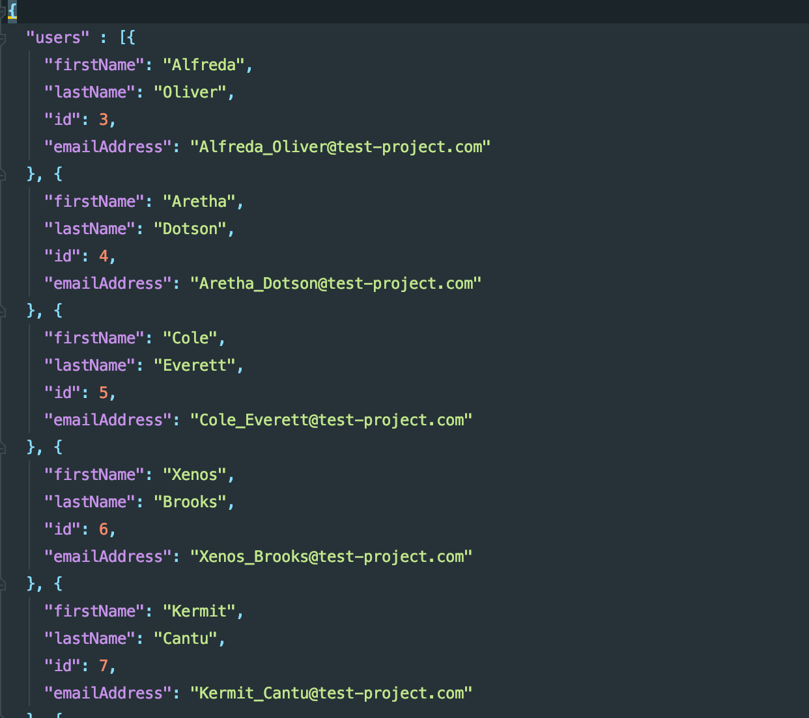
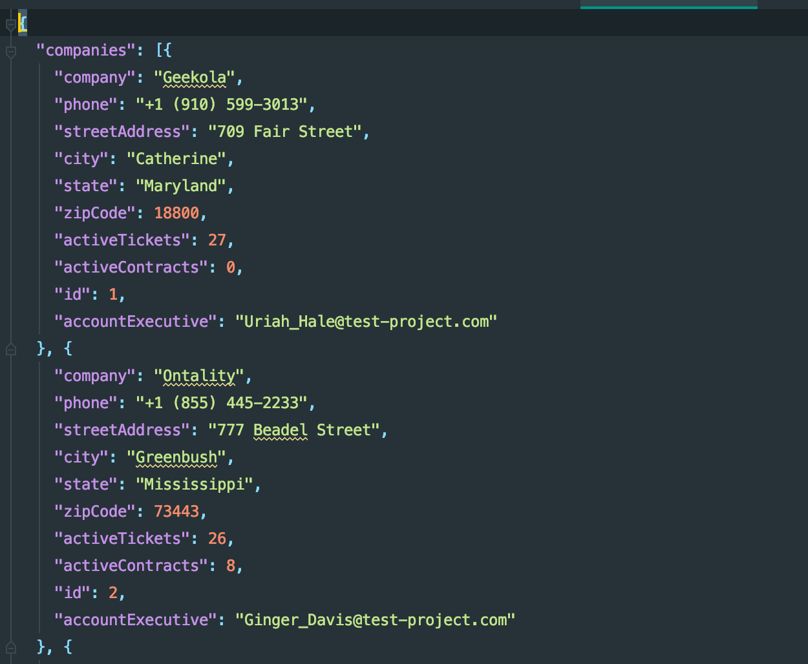

# The Challenge

The challenge is to create a .NET Core web API (using any sort of boilerplate, something like dotnet create webapi is fine) that will interface with a React frontend, providing it the necessary data. Feel free to use any additional Nuget packages to accomplish your goal as you see fit.

## Requirements

- Create a .NET Core web API that is able to return
  - A list of all Account Executives found within the Users.json file
  - A list of all Companies found within the Companies.json file
  - A list of all Companies tied to a specific Account Executive
- The following company data must be returned for each Account Executive:
   - Company Name
   - Address
   - Phone
   - Number of Active Tickets (represented by activeTickets)
   - Number of Active Contracts (represented by activeContracts)
 - Create small randomized delayed responses to simulate a database/API under load with some more processing than is actually occurring

This exercise is to test the following:
- How you build and structure a .NET Core web API
- Your understanding of RESTful Web Services
- Your understanding of backend to frontend integration
- Ability to take loose requirements and return a finished product

Take as much liberty with the exercise as you would like such that the end result represents something your proud of.

## API Endpoints

For these endpoints the data is static.

There is no authorization required, this is completely fake auto-generated information.

### Users
Returns an array of "users" objects, representing Account Executives.

```
GET: https://[your-api-host].net/api/users 
```




### Companies
Returns the ENTIRE array of "companies" objects.

```
GET: https://[your-api-host].net/api/companies 
```



### Companies
Returns an array of the company objects where the email matches on the accountExecutive field (case insensitive).

```
POST: https://[your-api-host].net/api/companies 
```

```
{
"accountExecutive": "Dane_Randolph@test-project.com"
}
```

Sample body above, only need to pass in a json body with a single property, "accountExecutive". This can be retrieved from the /api/users endpoint.

## Submission

Create a public repo in Github and send us a link to the repo in your GitHub account when you're complete. 

Let us know if you run into any issues or have questions, just send an email to your hiring point of contact any time.